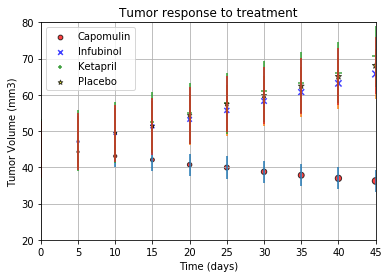
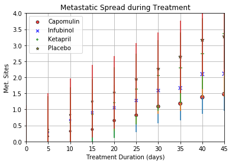
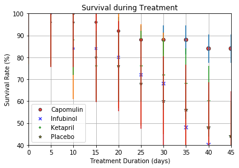
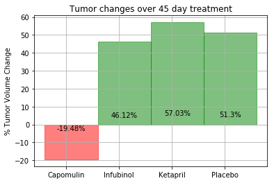

```python
#Get dependencies
import pandas as pd
import numpy as np
import matplotlib.pyplot as plt
import statistics


#Set paths to datasets
ds_clinical_trial = "raw_data/clinicaltrial_data.csv"
ds_drug_data = "raw_data/mouse_drug_data.csv"

#Read datasets into dataframes
clinical_trial_df = pd.read_csv(ds_clinical_trial)
drug_data_df = pd.read_csv(ds_drug_data)

#Join datasets
merged_df = clinical_trial_df.merge(drug_data_df, how="inner", on="Mouse ID")
merged_df.head()
```


<div>
<style>
    .dataframe thead tr:only-child th {
        text-align: right;
    }

    .dataframe thead th {
        text-align: left;
    }

    .dataframe tbody tr th {
        vertical-align: top;
    }
</style>
<table border="1" class="dataframe">
  <thead>
    <tr style="text-align: right;">
      <th></th>
      <th>Mouse ID</th>
      <th>Timepoint</th>
      <th>Tumor Volume (mm3)</th>
      <th>Metastatic Sites</th>
      <th>Drug</th>
    </tr>
  </thead>
  <tbody>
    <tr>
      <th>0</th>
      <td>b128</td>
      <td>0</td>
      <td>45.000000</td>
      <td>0</td>
      <td>Capomulin</td>
    </tr>
    <tr>
      <th>1</th>
      <td>b128</td>
      <td>5</td>
      <td>45.651331</td>
      <td>0</td>
      <td>Capomulin</td>
    </tr>
    <tr>
      <th>2</th>
      <td>b128</td>
      <td>10</td>
      <td>43.270852</td>
      <td>0</td>
      <td>Capomulin</td>
    </tr>
    <tr>
      <th>3</th>
      <td>b128</td>
      <td>15</td>
      <td>43.784893</td>
      <td>0</td>
      <td>Capomulin</td>
    </tr>
    <tr>
      <th>4</th>
      <td>b128</td>
      <td>20</td>
      <td>42.731552</td>
      <td>0</td>
      <td>Capomulin</td>
    </tr>
  </tbody>
</table>
</div>


```python

#Group by Drug and Timepoint
grouped_df = merged_df.groupby(["Drug","Timepoint"]).mean().apply(lambda x: x)
grouped_df.head()
```


<div>
<style>
    .dataframe thead tr:only-child th {
        text-align: right;
    }

    .dataframe thead th {
        text-align: left;
    }

    .dataframe tbody tr th {
        vertical-align: top;
    }
</style>
<table border="1" class="dataframe">
  <thead>
    <tr style="text-align: right;">
      <th></th>
      <th></th>
      <th>Tumor Volume (mm3)</th>
      <th>Metastatic Sites</th>
    </tr>
    <tr>
      <th>Drug</th>
      <th>Timepoint</th>
      <th></th>
      <th></th>
    </tr>
  </thead>
  <tbody>
    <tr>
      <th rowspan="5" valign="top">Capomulin</th>
      <th>0</th>
      <td>45.000000</td>
      <td>0.000000</td>
    </tr>
    <tr>
      <th>5</th>
      <td>44.266086</td>
      <td>0.160000</td>
    </tr>
    <tr>
      <th>10</th>
      <td>43.084291</td>
      <td>0.320000</td>
    </tr>
    <tr>
      <th>15</th>
      <td>42.064317</td>
      <td>0.375000</td>
    </tr>
    <tr>
      <th>20</th>
      <td>40.716325</td>
      <td>0.652174</td>
    </tr>
  </tbody>
</table>
</div>


```python
#Reset index of grouped dataset
grouped_df = grouped_df.reset_index()
```


```python
#Pivot
tumor_vol_df = grouped_df.pivot(index="Timepoint", columns="Drug", values="Tumor Volume (mm3)")

tumor_vol_df
```


<div>
<style>
    .dataframe thead tr:only-child th {
        text-align: right;
    }

    .dataframe thead th {
        text-align: left;
    }

    .dataframe tbody tr th {
        vertical-align: top;
    }
</style>
<table border="1" class="dataframe">
  <thead>
    <tr style="text-align: right;">
      <th>Drug</th>
      <th>Capomulin</th>
      <th>Ceftamin</th>
      <th>Infubinol</th>
      <th>Ketapril</th>
      <th>Naftisol</th>
      <th>Placebo</th>
      <th>Propriva</th>
      <th>Ramicane</th>
      <th>Stelasyn</th>
      <th>Zoniferol</th>
    </tr>
    <tr>
      <th>Timepoint</th>
      <th></th>
      <th></th>
      <th></th>
      <th></th>
      <th></th>
      <th></th>
      <th></th>
      <th></th>
      <th></th>
      <th></th>
    </tr>
  </thead>
  <tbody>
    <tr>
      <th>0</th>
      <td>45.000000</td>
      <td>45.000000</td>
      <td>45.000000</td>
      <td>45.000000</td>
      <td>45.000000</td>
      <td>45.000000</td>
      <td>45.000000</td>
      <td>45.000000</td>
      <td>45.000000</td>
      <td>45.000000</td>
    </tr>
    <tr>
      <th>5</th>
      <td>44.266086</td>
      <td>46.503051</td>
      <td>47.062001</td>
      <td>47.389175</td>
      <td>46.796098</td>
      <td>47.125589</td>
      <td>47.248967</td>
      <td>43.944859</td>
      <td>47.527452</td>
      <td>46.851818</td>
    </tr>
    <tr>
      <th>10</th>
      <td>43.084291</td>
      <td>48.285125</td>
      <td>49.403909</td>
      <td>49.582269</td>
      <td>48.694210</td>
      <td>49.423329</td>
      <td>49.101541</td>
      <td>42.531957</td>
      <td>49.463844</td>
      <td>48.689881</td>
    </tr>
    <tr>
      <th>15</th>
      <td>42.064317</td>
      <td>50.094055</td>
      <td>51.296397</td>
      <td>52.399974</td>
      <td>50.933018</td>
      <td>51.359742</td>
      <td>51.067318</td>
      <td>41.495061</td>
      <td>51.529409</td>
      <td>50.779059</td>
    </tr>
    <tr>
      <th>20</th>
      <td>40.716325</td>
      <td>52.157049</td>
      <td>53.197691</td>
      <td>54.920935</td>
      <td>53.644087</td>
      <td>54.364417</td>
      <td>53.346737</td>
      <td>40.238325</td>
      <td>54.067395</td>
      <td>53.170334</td>
    </tr>
    <tr>
      <th>25</th>
      <td>39.939528</td>
      <td>54.287674</td>
      <td>55.715252</td>
      <td>57.678982</td>
      <td>56.731968</td>
      <td>57.482574</td>
      <td>55.504138</td>
      <td>38.974300</td>
      <td>56.166123</td>
      <td>55.432935</td>
    </tr>
    <tr>
      <th>30</th>
      <td>38.769339</td>
      <td>56.769517</td>
      <td>58.299397</td>
      <td>60.994507</td>
      <td>59.559509</td>
      <td>59.809063</td>
      <td>58.196374</td>
      <td>38.703137</td>
      <td>59.826738</td>
      <td>57.713531</td>
    </tr>
    <tr>
      <th>35</th>
      <td>37.816839</td>
      <td>58.827548</td>
      <td>60.742461</td>
      <td>63.371686</td>
      <td>62.685087</td>
      <td>62.420615</td>
      <td>60.350199</td>
      <td>37.451996</td>
      <td>62.440699</td>
      <td>60.089372</td>
    </tr>
    <tr>
      <th>40</th>
      <td>36.958001</td>
      <td>61.467895</td>
      <td>63.162824</td>
      <td>66.068580</td>
      <td>65.600754</td>
      <td>65.052675</td>
      <td>63.045537</td>
      <td>36.574081</td>
      <td>65.356386</td>
      <td>62.916692</td>
    </tr>
    <tr>
      <th>45</th>
      <td>36.236114</td>
      <td>64.132421</td>
      <td>65.755562</td>
      <td>70.662958</td>
      <td>69.265506</td>
      <td>68.084082</td>
      <td>66.258529</td>
      <td>34.955595</td>
      <td>68.438310</td>
      <td>65.960888</td>
    </tr>
  </tbody>
</table>
</div>


```python
#Scatter plot to show tumor volume changes over time
#Get X-Axis
x_axis = tumor_vol_df.index.tolist()

#Create lists
tumor_data_c = tumor_vol_df["Capomulin"].tolist()
tumor_data_i = tumor_vol_df["Infubinol"].tolist()
tumor_data_k = tumor_vol_df["Ketapril"].tolist()
tumor_data_p = tumor_vol_df["Placebo"].tolist()

#Calculate standard deviation
err_c = statistics.stdev(tumor_data_c)
err_i = statistics.stdev(tumor_data_i)
err_k = statistics.stdev(tumor_data_k)
err_p = statistics.stdev(tumor_data_p)

#Plot
tumor_scatter_c = plt.scatter(x_axis, tumor_data_c, marker="o", facecolors="red", edgecolors="black",
            s=x_axis, alpha=0.75)
tumor_scatter_i = plt.scatter(x_axis, tumor_data_i, marker="x", facecolors="blue", edgecolors="black",
            s=x_axis, alpha=0.75)
tumor_scatter_k = plt.scatter(x_axis, tumor_data_k, marker="+", facecolors="green", edgecolors="black",
            s=x_axis, alpha=0.75)
tumor_scatter_p = plt.scatter(x_axis, tumor_data_p, marker="*", facecolors="yellow", edgecolors="black",
            s=x_axis, alpha=0.75)

#Add error bars
plt.errorbar(x_axis, tumor_data_c, yerr=err_c, linestyle="None")
plt.errorbar(x_axis, tumor_data_i, yerr=err_i, linestyle="None")
plt.errorbar(x_axis, tumor_data_k, yerr=err_k, linestyle="None")
plt.errorbar(x_axis, tumor_data_p, yerr=err_p, linestyle="None")

#Final formatting
plt.xlim(0,45)
plt.ylim(20,80)
plt.title("Tumor response to treatment")
plt.xlabel("Time (days)")
plt.ylabel("Tumor Volume (mm3)")
plt.grid()
plt.legend([tumor_scatter_c, tumor_scatter_i, tumor_scatter_k, tumor_scatter_p], ["Capomulin", "Infubinol", "Ketapril", "Placebo"])
plt.show()
```





```python
#Pivot
metas_site_df = grouped_df.pivot(index="Timepoint", columns="Drug", values="Metastatic Sites")

metas_site_df
```


<div>
<style>
    .dataframe thead tr:only-child th {
        text-align: right;
    }

    .dataframe thead th {
        text-align: left;
    }

    .dataframe tbody tr th {
        vertical-align: top;
    }
</style>
<table border="1" class="dataframe">
  <thead>
    <tr style="text-align: right;">
      <th>Drug</th>
      <th>Capomulin</th>
      <th>Ceftamin</th>
      <th>Infubinol</th>
      <th>Ketapril</th>
      <th>Naftisol</th>
      <th>Placebo</th>
      <th>Propriva</th>
      <th>Ramicane</th>
      <th>Stelasyn</th>
      <th>Zoniferol</th>
    </tr>
    <tr>
      <th>Timepoint</th>
      <th></th>
      <th></th>
      <th></th>
      <th></th>
      <th></th>
      <th></th>
      <th></th>
      <th></th>
      <th></th>
      <th></th>
    </tr>
  </thead>
  <tbody>
    <tr>
      <th>0</th>
      <td>0.000000</td>
      <td>0.000000</td>
      <td>0.000000</td>
      <td>0.000000</td>
      <td>0.000000</td>
      <td>0.000000</td>
      <td>0.000000</td>
      <td>0.000000</td>
      <td>0.000000</td>
      <td>0.000000</td>
    </tr>
    <tr>
      <th>5</th>
      <td>0.160000</td>
      <td>0.380952</td>
      <td>0.280000</td>
      <td>0.304348</td>
      <td>0.260870</td>
      <td>0.375000</td>
      <td>0.320000</td>
      <td>0.120000</td>
      <td>0.240000</td>
      <td>0.166667</td>
    </tr>
    <tr>
      <th>10</th>
      <td>0.320000</td>
      <td>0.600000</td>
      <td>0.666667</td>
      <td>0.590909</td>
      <td>0.523810</td>
      <td>0.833333</td>
      <td>0.565217</td>
      <td>0.250000</td>
      <td>0.478261</td>
      <td>0.500000</td>
    </tr>
    <tr>
      <th>15</th>
      <td>0.375000</td>
      <td>0.789474</td>
      <td>0.904762</td>
      <td>0.842105</td>
      <td>0.857143</td>
      <td>1.250000</td>
      <td>0.764706</td>
      <td>0.333333</td>
      <td>0.782609</td>
      <td>0.809524</td>
    </tr>
    <tr>
      <th>20</th>
      <td>0.652174</td>
      <td>1.111111</td>
      <td>1.050000</td>
      <td>1.210526</td>
      <td>1.150000</td>
      <td>1.526316</td>
      <td>1.000000</td>
      <td>0.347826</td>
      <td>0.952381</td>
      <td>1.294118</td>
    </tr>
    <tr>
      <th>25</th>
      <td>0.818182</td>
      <td>1.500000</td>
      <td>1.277778</td>
      <td>1.631579</td>
      <td>1.500000</td>
      <td>1.941176</td>
      <td>1.357143</td>
      <td>0.652174</td>
      <td>1.157895</td>
      <td>1.687500</td>
    </tr>
    <tr>
      <th>30</th>
      <td>1.090909</td>
      <td>1.937500</td>
      <td>1.588235</td>
      <td>2.055556</td>
      <td>2.066667</td>
      <td>2.266667</td>
      <td>1.615385</td>
      <td>0.782609</td>
      <td>1.388889</td>
      <td>1.933333</td>
    </tr>
    <tr>
      <th>35</th>
      <td>1.181818</td>
      <td>2.071429</td>
      <td>1.666667</td>
      <td>2.294118</td>
      <td>2.266667</td>
      <td>2.642857</td>
      <td>2.300000</td>
      <td>0.952381</td>
      <td>1.562500</td>
      <td>2.285714</td>
    </tr>
    <tr>
      <th>40</th>
      <td>1.380952</td>
      <td>2.357143</td>
      <td>2.100000</td>
      <td>2.733333</td>
      <td>2.466667</td>
      <td>3.166667</td>
      <td>2.777778</td>
      <td>1.100000</td>
      <td>1.583333</td>
      <td>2.785714</td>
    </tr>
    <tr>
      <th>45</th>
      <td>1.476190</td>
      <td>2.692308</td>
      <td>2.111111</td>
      <td>3.363636</td>
      <td>2.538462</td>
      <td>3.272727</td>
      <td>2.571429</td>
      <td>1.250000</td>
      <td>1.727273</td>
      <td>3.071429</td>
    </tr>
  </tbody>
</table>
</div>


```python
#Scatter plot to show tumor volume changes over time
x_axis = metas_site_df.index.tolist()

#Create lists
metas_data_c = metas_site_df["Capomulin"].tolist()
metas_data_i = metas_site_df["Infubinol"].tolist()
metas_data_k = metas_site_df["Ketapril"].tolist()
metas_data_p = metas_site_df["Placebo"].tolist()

#Calculate standard deviation
err_c = statistics.stdev(metas_data_c)
err_i = statistics.stdev(metas_data_i)
err_k = statistics.stdev(metas_data_k)
err_p = statistics.stdev(metas_data_p)

metas_scatter_c = plt.scatter(x_axis, metas_data_c, marker="o", facecolors="red", edgecolors="black",
            s=x_axis, alpha=0.75)
metas_scatter_i = plt.scatter(x_axis, metas_data_i, marker="x", facecolors="blue", edgecolors="black",
            s=x_axis, alpha=0.75)
metas_scatter_k = plt.scatter(x_axis, metas_data_k, marker="+", facecolors="green", edgecolors="black",
            s=x_axis, alpha=0.75)
metas_scatter_p = plt.scatter(x_axis, metas_data_p, marker="*", facecolors="yellow", edgecolors="black",
            s=x_axis, alpha=0.75)

#Add error bars
plt.errorbar(x_axis, metas_data_c, yerr=err_c, linestyle="None")
plt.errorbar(x_axis, metas_data_i, yerr=err_i, linestyle="None")
plt.errorbar(x_axis, metas_data_k, yerr=err_k, linestyle="None")
plt.errorbar(x_axis, metas_data_p, yerr=err_p, linestyle="None")

#Final Formatting
plt.xlim(0,45)
plt.ylim(0.0,4.0)
plt.title("Metastatic Spread during Treatment")
plt.xlabel("Treatment Duration (days)")
plt.ylabel("Met. Sites")
plt.grid()
plt.legend([tumor_scatter_c, tumor_scatter_i, tumor_scatter_k, tumor_scatter_p], ["Capomulin", "Infubinol", "Ketapril", "Placebo"])
plt.show()
```





```python
#Group by Drug and Timepoint
grouped_df_2 = merged_df.groupby(["Drug","Timepoint"]).count().apply(lambda x: x)
grouped_df_2.head()
```


<div>
<style>
    .dataframe thead tr:only-child th {
        text-align: right;
    }

    .dataframe thead th {
        text-align: left;
    }

    .dataframe tbody tr th {
        vertical-align: top;
    }
</style>
<table border="1" class="dataframe">
  <thead>
    <tr style="text-align: right;">
      <th></th>
      <th></th>
      <th>Mouse ID</th>
      <th>Tumor Volume (mm3)</th>
      <th>Metastatic Sites</th>
    </tr>
    <tr>
      <th>Drug</th>
      <th>Timepoint</th>
      <th></th>
      <th></th>
      <th></th>
    </tr>
  </thead>
  <tbody>
    <tr>
      <th rowspan="5" valign="top">Capomulin</th>
      <th>0</th>
      <td>25</td>
      <td>25</td>
      <td>25</td>
    </tr>
    <tr>
      <th>5</th>
      <td>25</td>
      <td>25</td>
      <td>25</td>
    </tr>
    <tr>
      <th>10</th>
      <td>25</td>
      <td>25</td>
      <td>25</td>
    </tr>
    <tr>
      <th>15</th>
      <td>24</td>
      <td>24</td>
      <td>24</td>
    </tr>
    <tr>
      <th>20</th>
      <td>23</td>
      <td>23</td>
      <td>23</td>
    </tr>
  </tbody>
</table>
</div>


```python
#Reset index of grouped dataset
grouped_df_2 = grouped_df_2.reset_index()
grouped_df_2.head()
```


<div>
<style>
    .dataframe thead tr:only-child th {
        text-align: right;
    }

    .dataframe thead th {
        text-align: left;
    }

    .dataframe tbody tr th {
        vertical-align: top;
    }
</style>
<table border="1" class="dataframe">
  <thead>
    <tr style="text-align: right;">
      <th></th>
      <th>Drug</th>
      <th>Timepoint</th>
      <th>Mouse ID</th>
      <th>Tumor Volume (mm3)</th>
      <th>Metastatic Sites</th>
    </tr>
  </thead>
  <tbody>
    <tr>
      <th>0</th>
      <td>Capomulin</td>
      <td>0</td>
      <td>25</td>
      <td>25</td>
      <td>25</td>
    </tr>
    <tr>
      <th>1</th>
      <td>Capomulin</td>
      <td>5</td>
      <td>25</td>
      <td>25</td>
      <td>25</td>
    </tr>
    <tr>
      <th>2</th>
      <td>Capomulin</td>
      <td>10</td>
      <td>25</td>
      <td>25</td>
      <td>25</td>
    </tr>
    <tr>
      <th>3</th>
      <td>Capomulin</td>
      <td>15</td>
      <td>24</td>
      <td>24</td>
      <td>24</td>
    </tr>
    <tr>
      <th>4</th>
      <td>Capomulin</td>
      <td>20</td>
      <td>23</td>
      <td>23</td>
      <td>23</td>
    </tr>
  </tbody>
</table>
</div>


```python
#Pivot
survival_rate_df = grouped_df_2.pivot(index="Timepoint", columns="Drug", values="Mouse ID")
survival_rate_df
```


<div>
<style>
    .dataframe thead tr:only-child th {
        text-align: right;
    }

    .dataframe thead th {
        text-align: left;
    }

    .dataframe tbody tr th {
        vertical-align: top;
    }
</style>
<table border="1" class="dataframe">
  <thead>
    <tr style="text-align: right;">
      <th>Drug</th>
      <th>Capomulin</th>
      <th>Ceftamin</th>
      <th>Infubinol</th>
      <th>Ketapril</th>
      <th>Naftisol</th>
      <th>Placebo</th>
      <th>Propriva</th>
      <th>Ramicane</th>
      <th>Stelasyn</th>
      <th>Zoniferol</th>
    </tr>
    <tr>
      <th>Timepoint</th>
      <th></th>
      <th></th>
      <th></th>
      <th></th>
      <th></th>
      <th></th>
      <th></th>
      <th></th>
      <th></th>
      <th></th>
    </tr>
  </thead>
  <tbody>
    <tr>
      <th>0</th>
      <td>25</td>
      <td>25</td>
      <td>25</td>
      <td>25</td>
      <td>25</td>
      <td>25</td>
      <td>26</td>
      <td>25</td>
      <td>26</td>
      <td>25</td>
    </tr>
    <tr>
      <th>5</th>
      <td>25</td>
      <td>21</td>
      <td>25</td>
      <td>23</td>
      <td>23</td>
      <td>24</td>
      <td>25</td>
      <td>25</td>
      <td>25</td>
      <td>24</td>
    </tr>
    <tr>
      <th>10</th>
      <td>25</td>
      <td>20</td>
      <td>21</td>
      <td>22</td>
      <td>21</td>
      <td>24</td>
      <td>23</td>
      <td>24</td>
      <td>23</td>
      <td>22</td>
    </tr>
    <tr>
      <th>15</th>
      <td>24</td>
      <td>19</td>
      <td>21</td>
      <td>19</td>
      <td>21</td>
      <td>20</td>
      <td>17</td>
      <td>24</td>
      <td>23</td>
      <td>21</td>
    </tr>
    <tr>
      <th>20</th>
      <td>23</td>
      <td>18</td>
      <td>20</td>
      <td>19</td>
      <td>20</td>
      <td>19</td>
      <td>17</td>
      <td>23</td>
      <td>21</td>
      <td>17</td>
    </tr>
    <tr>
      <th>25</th>
      <td>22</td>
      <td>18</td>
      <td>18</td>
      <td>19</td>
      <td>18</td>
      <td>17</td>
      <td>14</td>
      <td>23</td>
      <td>19</td>
      <td>16</td>
    </tr>
    <tr>
      <th>30</th>
      <td>22</td>
      <td>16</td>
      <td>17</td>
      <td>18</td>
      <td>15</td>
      <td>15</td>
      <td>13</td>
      <td>23</td>
      <td>18</td>
      <td>15</td>
    </tr>
    <tr>
      <th>35</th>
      <td>22</td>
      <td>14</td>
      <td>12</td>
      <td>17</td>
      <td>15</td>
      <td>14</td>
      <td>10</td>
      <td>21</td>
      <td>16</td>
      <td>14</td>
    </tr>
    <tr>
      <th>40</th>
      <td>21</td>
      <td>14</td>
      <td>10</td>
      <td>15</td>
      <td>15</td>
      <td>12</td>
      <td>9</td>
      <td>20</td>
      <td>12</td>
      <td>14</td>
    </tr>
    <tr>
      <th>45</th>
      <td>21</td>
      <td>13</td>
      <td>9</td>
      <td>11</td>
      <td>13</td>
      <td>11</td>
      <td>7</td>
      <td>20</td>
      <td>11</td>
      <td>14</td>
    </tr>
  </tbody>
</table>
</div>


```python
#Scatter plot to show survival rate over time
x_axis = survival_rate_df.index.tolist()
survival_rate_c = ((survival_rate_df["Capomulin"]/25)*100).tolist()
survival_rate_i = ((survival_rate_df["Infubinol"]/25)*100).tolist()
survival_rate_k = ((survival_rate_df["Ketapril"]/25)*100).tolist()
survival_rate_p = ((survival_rate_df["Placebo"]/25)*100).tolist()


#Calculate standard deviation
err_c = statistics.stdev(survival_rate_c)
err_i = statistics.stdev(survival_rate_i)
err_k = statistics.stdev(survival_rate_k)
err_p = statistics.stdev(survival_rate_p)

survival_scatter_c = plt.scatter(x_axis, survival_rate_c, marker="o", facecolors="red", edgecolors="black",
            s=x_axis, alpha=0.75)
survival_scatter_i = plt.scatter(x_axis, survival_rate_i, marker="x", facecolors="blue", edgecolors="black",
            s=x_axis, alpha=0.75)
survival_scatter_k = plt.scatter(x_axis, survival_rate_k, marker="+", facecolors="green", edgecolors="black",
            s=x_axis, alpha=0.75)
survival_scatter_p = plt.scatter(x_axis, survival_rate_p, marker="*", facecolors="yellow", edgecolors="black",
            s=x_axis, alpha=0.75)


#Add error bars
plt.errorbar(x_axis, survival_rate_c, yerr=err_c, linestyle="None")
plt.errorbar(x_axis, survival_rate_i, yerr=err_i, linestyle="None")
plt.errorbar(x_axis, survival_rate_k, yerr=err_k, linestyle="None")
plt.errorbar(x_axis, survival_rate_p, yerr=err_p, linestyle="None")

#Final formatting
plt.xlim(0,45)
plt.ylim(40,100)
plt.title("Survival during Treatment")
plt.xlabel("Treatment Duration (days)")
plt.ylabel("Survival Rate (%)")
plt.grid()
plt.legend([tumor_scatter_c, tumor_scatter_i, tumor_scatter_k, tumor_scatter_p], ["Capomulin", "Infubinol", "Ketapril", "Placebo"])
plt.show()
```





```python
#Create summary df
summary_df = round((tumor_vol_df.iloc[9].subtract(tumor_vol_df.iloc[0])/tumor_vol_df.iloc[0])*100, 2)
summary_df = summary_df.reset_index()
summary_df
```


<div>
<style>
    .dataframe thead tr:only-child th {
        text-align: right;
    }

    .dataframe thead th {
        text-align: left;
    }

    .dataframe tbody tr th {
        vertical-align: top;
    }
</style>
<table border="1" class="dataframe">
  <thead>
    <tr style="text-align: right;">
      <th></th>
      <th>Drug</th>
      <th>0</th>
    </tr>
  </thead>
  <tbody>
    <tr>
      <th>0</th>
      <td>Capomulin</td>
      <td>-19.48</td>
    </tr>
    <tr>
      <th>1</th>
      <td>Ceftamin</td>
      <td>42.52</td>
    </tr>
    <tr>
      <th>2</th>
      <td>Infubinol</td>
      <td>46.12</td>
    </tr>
    <tr>
      <th>3</th>
      <td>Ketapril</td>
      <td>57.03</td>
    </tr>
    <tr>
      <th>4</th>
      <td>Naftisol</td>
      <td>53.92</td>
    </tr>
    <tr>
      <th>5</th>
      <td>Placebo</td>
      <td>51.30</td>
    </tr>
    <tr>
      <th>6</th>
      <td>Propriva</td>
      <td>47.24</td>
    </tr>
    <tr>
      <th>7</th>
      <td>Ramicane</td>
      <td>-22.32</td>
    </tr>
    <tr>
      <th>8</th>
      <td>Stelasyn</td>
      <td>52.09</td>
    </tr>
    <tr>
      <th>9</th>
      <td>Zoniferol</td>
      <td>46.58</td>
    </tr>
  </tbody>
</table>
</div>


```python
#Get objects needed for bar graph
drug_list = ["Capomulin", "Infubinol", "Ketapril", "Placebo"]
summ_list = []

for drug in drug_list:
    summ_list.append(summary_df.loc[summary_df["Drug"] == drug, 0].iloc[0])
    
summary_bar_df = pd.DataFrame(summ_list, drug_list)
summary_bar_df = summary_bar_df.reset_index()
summary_bar_df.columns = ["Drug", "Tumor_Vol"]
summary_bar_df

print(summ_list)
```

    [-19.48, 46.119999999999997, 57.030000000000001, 51.299999999999997]


```python

#X axis ticks
x_axis = np.arange(len(drug_list))
tick_locations = [value+0.4 for value in x_axis]
summ_bar = plt.bar(x_axis, summ_list, color='r', alpha=0.5, align="edge", width=1.0)

#Title, labels, grid
plt.title("Tumor changes over 45 day treatment")
plt.ylabel("% Tumor Volume Change")
plt.xticks(tick_locations, drug_list)
plt.grid()

#Adding color and labels to individual bars
for rect, label in zip(summ_bar.patches, summ_list):
    height = rect.get_height()
    if label > 0:
        rect.set_color('g')
    else:
        rect.set_color('r')
    label = str(label) + "%"
    plt.text(rect.get_x() + rect.get_width()/2, height/9, label, ha='center', va='center')

plt.show()

#DONE!!
```




